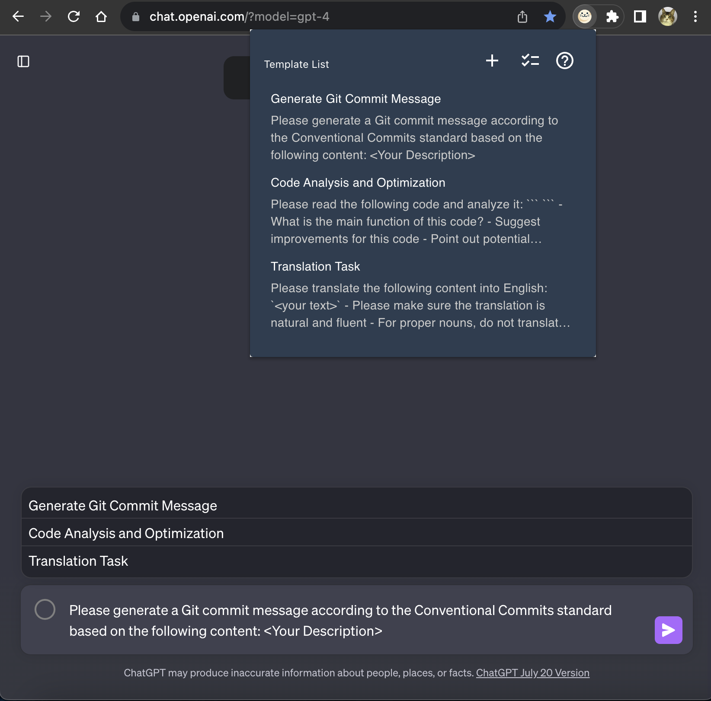
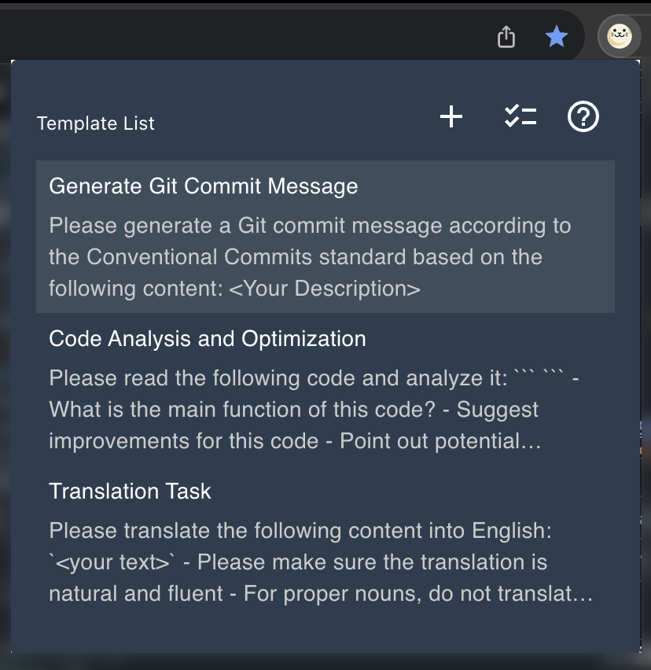
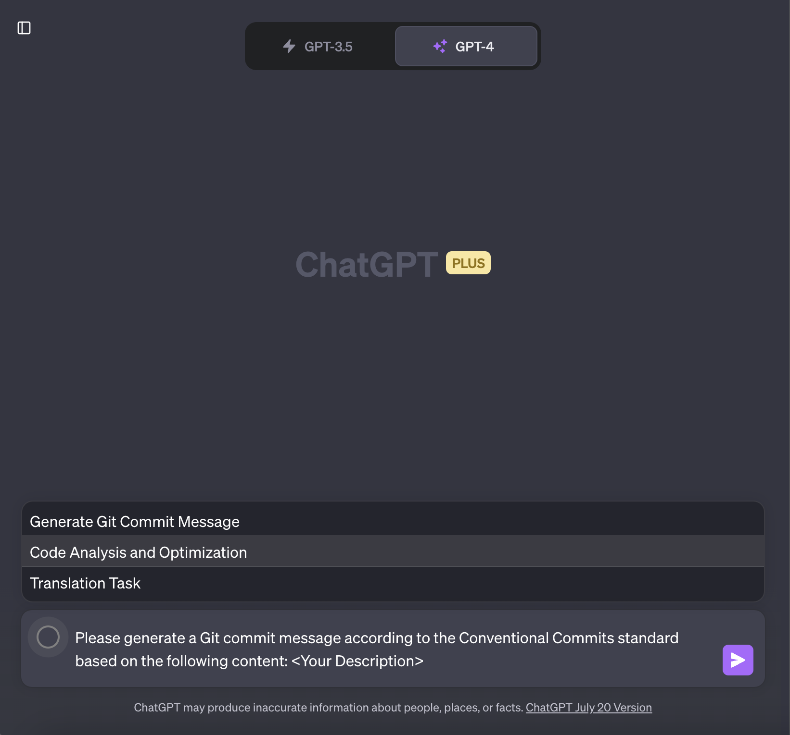

# 🦭 ChatGPT_Seal

[README](README.md) | [中文文档](README_zh.md)

    

ChatGPT_Seal 是一款针对 ChatGPT 的 Chrome 插件，帮助用户在 ChatGPT 的页面上快速输入预设的提示。避免了反复输入相同问题的繁琐操作，让你的交流更加便捷高效。

    

## 🚀 功能

- 保存你常用的问题或者输入，以便一键发送到 ChatGPT。
- 自定义模板，适配各种场景下的需求。
- 用户友好的界面，快速上手使用。

## 📥 如何安装

###  方法一：Google 应用商店（推荐🌟）

[Chrome 应用商店 | ChatGPT Seal](https://chrome.google.com/webstore/detail/chatgpt-seal/mebdcpkmkjfchchihecliclanaefgffd?utm_source=ext_sidebar&hl=zh-CN)

### 方法二：手动安装

1. 从 [下载页面](https://github.com/LouisTsang-jk/chatgpt-seal/releases) 下载安装文件(`ChatGPT_Seal.zip`)。
2. 打开 Chrome 浏览器，进入扩展程序界面(`chrome://extensions/`)。
3. 打开开发者模式。
4. 点击"加载已解压的扩展程序"，选择你下载的文件解压后的目录。
5. 此时，ChatGPT_Seal 已经成功安装到你的 Chrome 浏览器中，你可以在右上角的小海豹图标中查看。

## 🛠️ 如何使用

1. 打开 ChatGPT 页面。
2. 点击浏览器右上角的 ChatGPT_Seal 小海豹图标创建模板。

    

3. 然后在 ChatGPT 中输入文本框的附近会展示唤起的按钮 ⭕️

    

4. 点击展开模板列表，点击模板即可将模板内容填充

## 💡 常用模板

另外在[这里](<(./src/conf/prompts_zh.json)>)提供了常用的模板。

## 🤝 贡献指南

我们欢迎所有的贡献。你可以通过以下方式参与：

1. 在 GitHub 上报告错误或提交新功能请求。
2. 提交 pull request 来贡献代码。

更多信息，请参考 CONTRIBUTING.md（待创建）。

## 💬 讨论

我们使用 GitHub Discussions 作为讨论错误、新功能和改进项目的地方。欢迎加入这些对话，我们期待听到你的想法。

## 🐞 提交问题（Issue）指南

当创建新的问题时，请遵循以下步骤：

1. 为问题使用清晰且描述性强的标题。
2. 尽可能详细地描述复现问题的确切步骤。
3. 描述你在执行步骤后观察到的行为，并解释为什么这是一个问题。
4. 如果适用，包括演示问题的屏幕截图和动画 GIF。

更多信息，请参考 ISSUE_TEMPLATE.md（待创建）。
